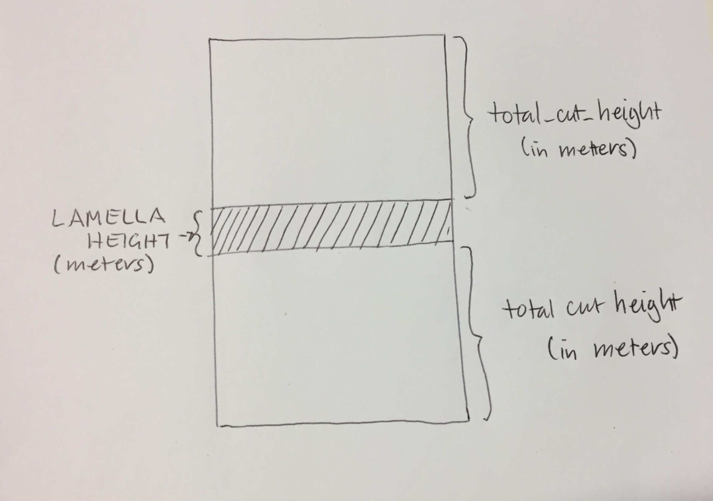
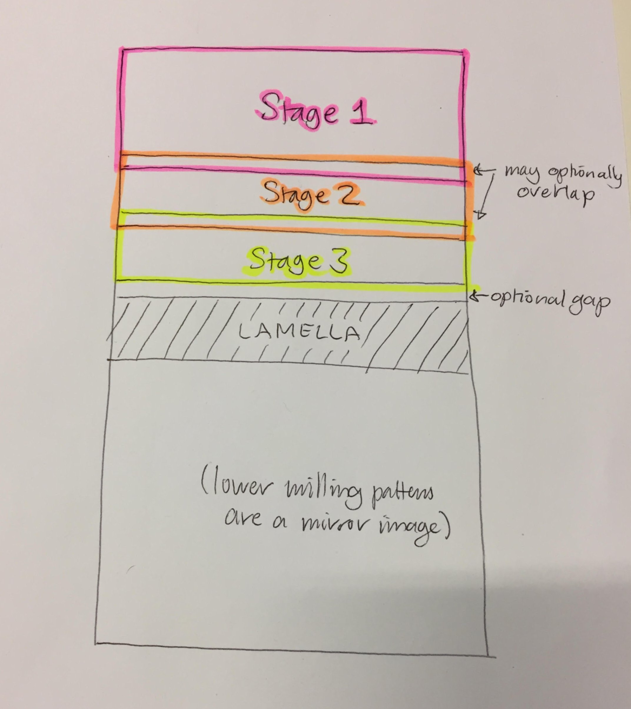
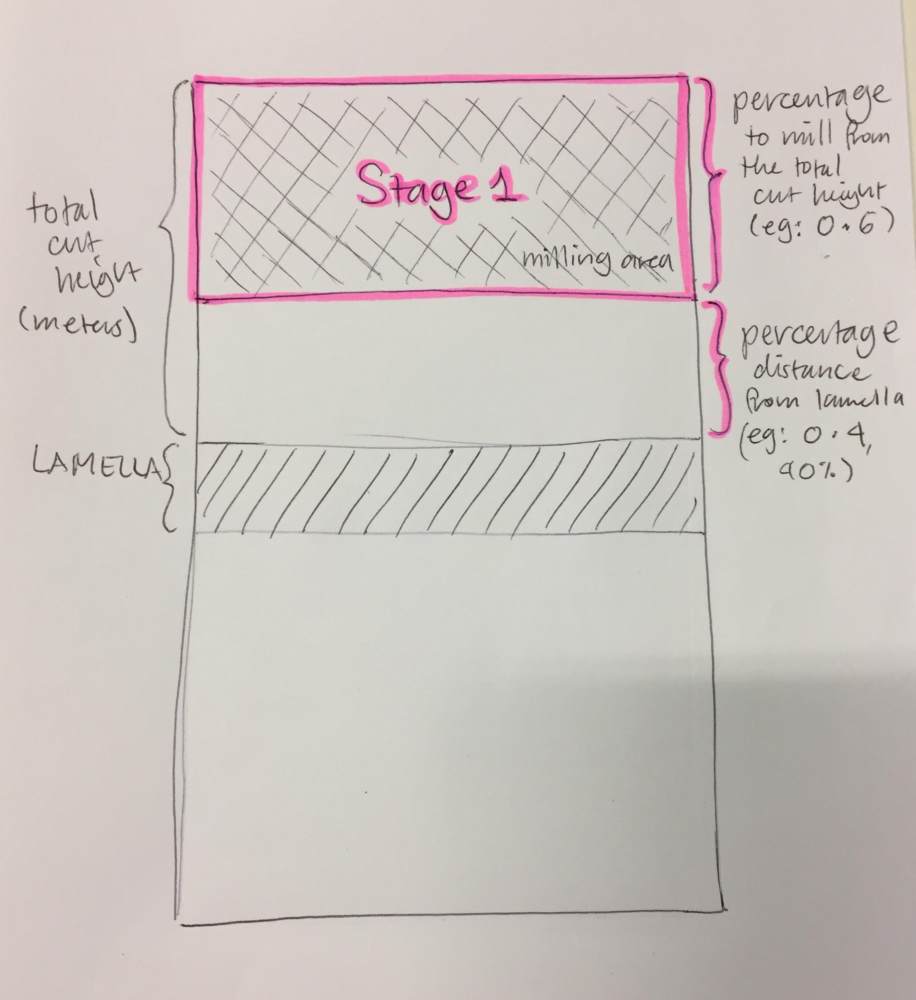
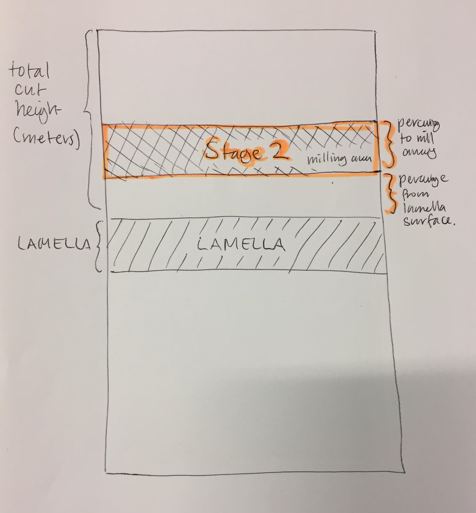
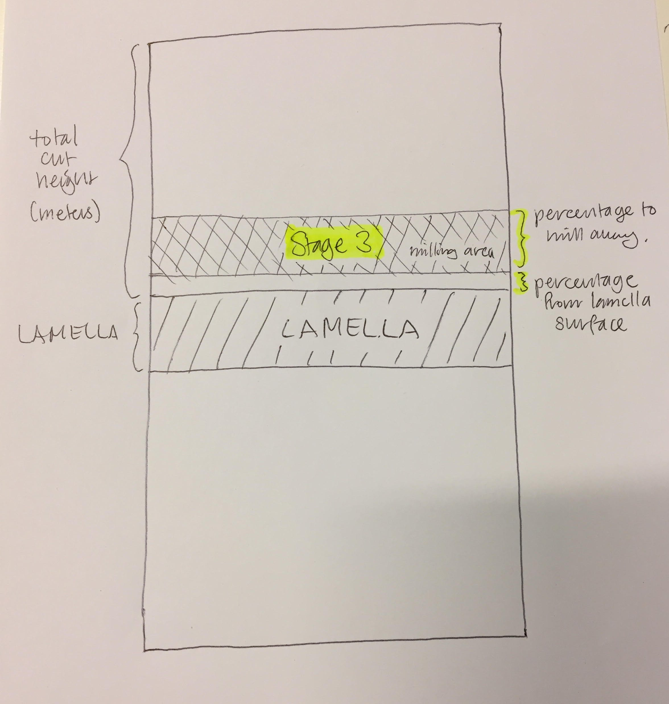

# User input

Users must provide input parameters for their experiment as a protocol YAML file, for example:

`example_protocol.yml`

```yaml
system:
  ip_address: '192.168.0.1'  # IP address to connect to the microscope.
  application_file_rectangle: 'Si'  # Application file for rectangle milling.
  application_file_cleaning_cross_section: 'Si'
imaging:  # Ion beam imaging parameters
  horizontal_field_width: 50e-6	# In meters. Horizontal field of view
  dwell_time: 1e-7  # In seconds. Dwell time of ion beam for imaging.
  resolution: '1536x1024'  # Must be one of the set resolutions available.
  autocontrast: false	# whether to automatically run auto contrast adjustment
  full_field_ib_images: false  # Whether to acquire multiple intermediate full field ion beam images (warning: high dose)
fiducial:  # Fiducial marker parameters
  reduced_area_resolution: '3072x2048'
  fiducial_length: 5e-7  # In meters. Fiducial cross stroke length.
  fiducial_width:  1e-7  # In meters. Fiducial cross stroke width.
  fiducial_image_size_x: 15e-7  # In meters. Field of view for fiducial in x.
  fiducial_image_size_y: 15e-7  # In meters. Field of view for fiducial in y.
  fiducial_milling_depth: 100e-9	# In meters. Milling depth of fiducial.
  fiducial_milling_current: 3e-10	# In Amperes. Milling current for fiducial marker.
  min_distance_from_lamella: 1e-7  # In meters. Buffer distance separating lamella from fiducial image.
lamella:  # Lamella parameters
  lamella_width:  5e-7  # In meters. Width of lamella.
  lamella_height: 1e-7  # In meters. Thickness of lamella.
  total_cut_height: 5e-7	# In meters. Combined milling region above & below.
  milling_depth: 1e-6	 # In meters. Default milling depth.
  milling_current: 1e-8	# In Amperes. Default milling current.
  # Protocol stages are milled in the order they appear here.
  # Stages may override the default parmeters above Eg: current, depth, etc.
  protocol_stages:
  # Rough cut, stage 1
  - percentage_roi_height: 0.5  # Milling size as fraction of total_cut_height.
    percentage_from_lamella_surface: 0.5  # Fraction from surface of lamella.
    milling_current: 3e-10  # In Amperes. Overrides the default current.
    milling_depth: 5e-7  # In meters. Overrides the default miling depth.
  # Regular cut, stage 2
  - percentage_roi_height: 0.4	# Milling size as fraction of total_cut_height.
    percentage_from_lamella_surface: 0.2  # Fraction from surface of lamella.
    milling_current: 1e-8  # In Amperes. Overrides the default current.
  # Polishing cut, stage 3
  - percentage_roi_height: 0.3  # Milling size as fraction of total_cut_height.
    percentage_from_lamella_surface: 0.  # Fraction from surface of lamella.
    milling_current: 3e-10  # In Amperes. Overrides the default current.
```

The end result is a trench above and below the lamella.
The size of this trench is described by `total_cut_height` in the user input parameters.



The final trench is typically produced using several stages of milling. The example we show here involves three stages:
1. First, a rough cut far from the lamella with a high ion beam current.
2. Next, an intermediate ion beam current is used to thin the lamella more.
3. Finally, a low current polishing stage is used to ensure the lamella surface is smooth.

The positions for the milling patterns at each of these stages may overlap, or not. This diagram (not to scale) shows three stages with a small amount of overlap:



To give the greates amount of flexibility to the user, the position of milling patterns for each milling stage are defined by two parameters: `percentage_roi_height`, and `percentage_from_lamella_surface`.

These are both percentages represented as *fractions* (eg: 0.5 is 50%).
* `percentage_roi_height` describes how large the size of the milling pattern for this stage should be, as a proportion of the total combined milling area (`total_cut_height`).
* `percentage_from_lamella_surface` describes how far away from the lamella surface the closest edge of the milling pattern should sit, as a proportion of the total combined milling area (`total_cut_height`).

These diagrams (not to scale) show this for our example protocol.






